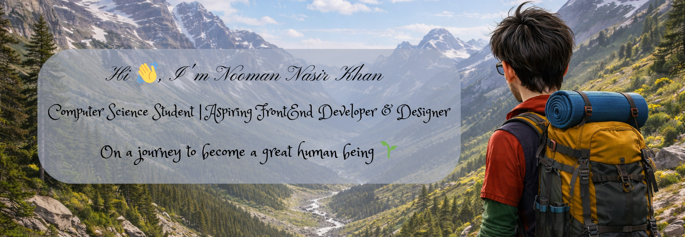

  

## 👨‍💻 About Me

I’m a **passionate and motivated Computer Science student** with a strong interest in  
**programming, web development, and problem-solving**.

- 🎓 B.Tech CSE (2022 – 2026)
- 💻 Love building real-world applications
- 🌱 Currently learning **Frontend + Web Development, Ui/Ux Designing & AI**
- 🚀 Exploring **full-stack development & system design**
- 🤝 Open to internships & collaborative projects

---

## 🛠️ Tech Stack & Tools

### 💻 Programming Languages

  

 

### 🌐 Web Technologies

  

 

### 🗄️ Databases & Tools

  

---

## 📌 Education

🎓 **Maharaj Vijayaram Gajapathi Raj College of Engineering**  
Bachelor of Technology – Computer Science  

🏫 **NRI Junior College**  
MPC (Maths, Physics, Chemistry) 

---

## 🚀 Featured Projects

<table border="0">
<tr>
<td width="50%" valign="top" style="border: none;">

### 🚗 SmartParkk
Smart parking system for community visitors to park efficiently, solving the hustle of parking spaces and entry/exit directory.
 
### 🏥 Health Care Chatbot (Python)
Helps with hospital search, appointments & emergency responses
 
### 🥬 Organic E-Commerce Website
Web app to sell organic vegetables grown on campus
 
### 🚆 Train Ticket Booking System (C)
Implemented using DSA concepts

</td>
<td width="50%" valign="top" style="border: none;">

### 🚗 Car Sales Management System (SQL)
Database system for sales & employee records
 
### 🍽️ Digital QR Menu
QR-based digital menu for cafes & restaurants
 
### 🧮 Basic Calculator
Built using HTML & CSS

</td>
</tr>
</table>

---

## 💼 Experience & Internships

- 👨‍💻 **Front-End Developer Intern – Cognifyz**
- 📊 **Data Visualization – TATA (Forage)**
- ☁️ **AWS Solution Architecture – Forage**

---

## 🌍 Communities

- 🌐 Google Developer Group (GDG)
- 🎥 BOI – Born On Instagram Creators
- ♻️ Swacha GLUG (College Club)

---

## 🌟 Strengths

- 🧠 Creative Problem Solving  
- 👥 Leadership & Team Management  
- 💬 Strong Communication Skills  

---

## 🎯 Hobbies

✍️ Writing | 📖 Reading | 🌱 Gardening | 🍳 Cooking | 🧹 Organizing | 👻 Watching Horror Genre | 🐱 Pet Care

---

## 📊 GitHub Analytics

  

  

---

## 🔗 Connect With Me

- 💼 [LinkedIn](https://www.linkedin.com/in/nooman-nasir-khan-07b49a26b)
- 🌐 [Portfolio](https://itsnooms.github.io/NOOMS/)
- 🧑‍💻 [GitHub](https://github.com/itsNooms)

---

✨ Thanks for visiting my profile ✨  
Let’s build something amazing together 🚀

